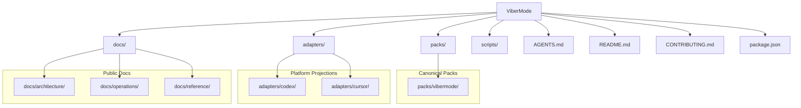
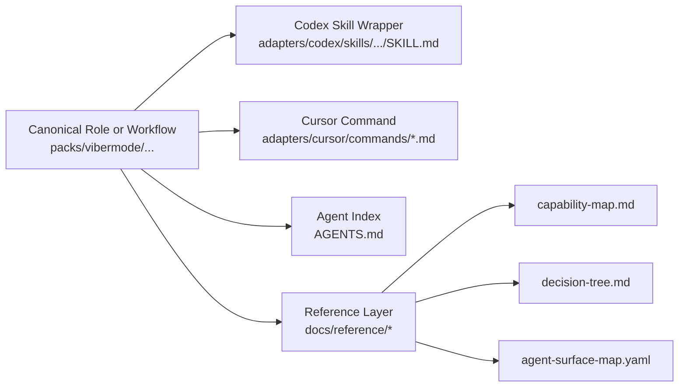
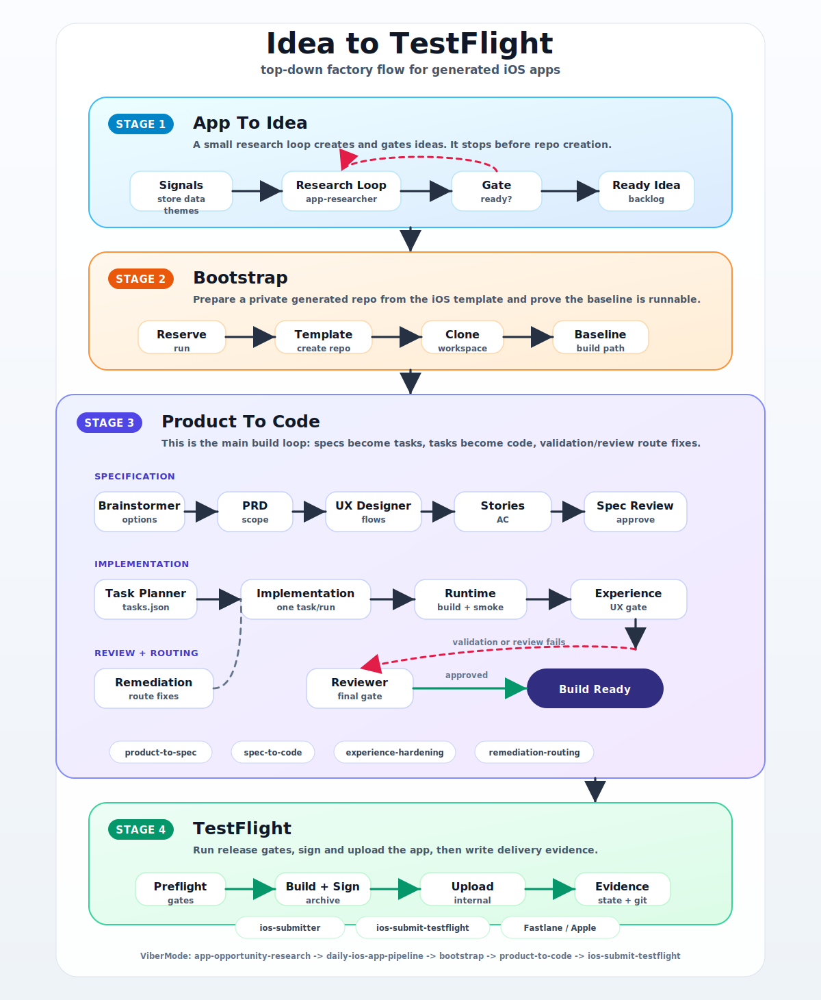
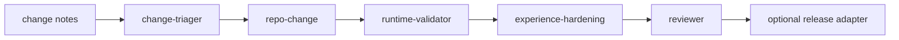
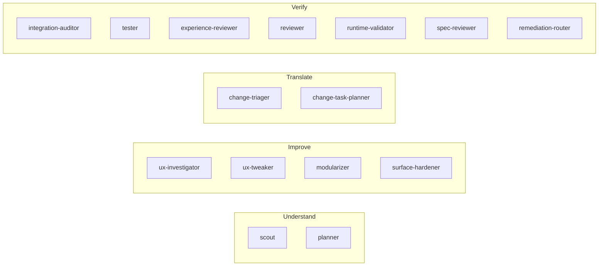

# ViberMode Visual Map

This document gives a quick visual model of the repository using Mermaid.

Use it when you want to explain:

- what is canonical vs projected
- where workflows and skills live
- how `packs/`, `adapters/`, `docs/`, and `scripts/` relate

## Top-Level Repository Map



## ViberMode Pack Map

```mermaid
flowchart TB
    vm["packs/vibermode/"]

    vm --> roles["roles/"]
    vm --> workflows["workflows/"]
    vm --> templates["templates/"]
    vm --> vm_readme["README.md"]

    subgraph roles_detail["roles/"]
        product["product/"]
        iterate["iterate/"]
    end
    roles --> product
    roles --> iterate

    subgraph product_roles["Product Roles"]
        analyzer["analyzer"]
        app_researcher["app-researcher"]
        brainstormer["brainstormer"]
        prd["prd"]
        ux_designer["ux-designer"]
        user_stories["user-stories"]
        bootstrap["bootstrap"]
        task_planner["task-planner"]
        implementation_runner["implementation-runner"]
        ios_submitter["ios-submitter"]
        ralph_converter["ralph-converter legacy"]
        ralph_runner["ralph-runner legacy"]
    end
    product --> analyzer
    product --> app_researcher
    product --> brainstormer
    product --> prd
    product --> ux_designer
    product --> user_stories
    product --> bootstrap
    product --> task_planner
    product --> implementation_runner
    product --> ios_submitter
    product --> ralph_converter
    product --> ralph_runner

    subgraph iterate_roles["Iterate Roles"]
        scout["scout"]
        planner["planner"]
        change_triager["change-triager"]
        ux_tweaker["ux-tweaker"]
        ux_investigator["ux-investigator"]
        modularizer["modularizer"]
        surface_hardener["surface-hardener"]
        experience_reviewer["experience-reviewer"]
        integration_auditor["integration-auditor"]
        tester["tester"]
        reviewer["reviewer"]
        runtime_validator["runtime-validator"]
        spec_reviewer["spec-reviewer"]
        remediation_router["remediation-router"]
        change_task_planner["change-task-planner"]
    end
    iterate --> scout
    iterate --> planner
    iterate --> change_triager
    iterate --> ux_tweaker
    iterate --> ux_investigator
    iterate --> modularizer
    iterate --> surface_hardener
    iterate --> experience_reviewer
    iterate --> integration_auditor
    iterate --> tester
    iterate --> reviewer
    iterate --> runtime_validator
    iterate --> spec_reviewer
    iterate --> remediation_router
    iterate --> change_task_planner

    subgraph workflow_detail["Workflows"]
        app_opportunity_research["app-opportunity-research"]
        idea_research_backlog["idea-research-backlog"]
        daily_ios_app_pipeline["daily-ios-app-pipeline"]
        product_to_spec["product-to-spec"]
        bootstrap_workflow["bootstrap"]
        spec_to_code["spec-to-code"]
        product_to_code["product-to-code"]
        repo_change["repo-change"]
        experience_hardening["experience-hardening"]
        change_to_release["change-to-release"]
        remediation_routing["remediation-routing"]
        ios_submit_testflight["ios-submit-testflight"]
    end
    workflows --> app_opportunity_research
    workflows --> idea_research_backlog
    workflows --> daily_ios_app_pipeline
    workflows --> product_to_spec
    workflows --> bootstrap_workflow
    workflows --> spec_to_code
    workflows --> product_to_code
    workflows --> repo_change
    workflows --> experience_hardening
    workflows --> change_to_release
    workflows --> remediation_routing
    workflows --> ios_submit_testflight

    subgraph template_detail["Templates"]
        prd_template["prd-template.md"]
        stories_template["stories-template.md"]
        ux_template["ux-spec-template.md"]
    end
    templates --> prd_template
    templates --> stories_template
    templates --> ux_template
```



## Projection Model



## Product Pipeline View

```mermaid
flowchart LR
    analyzer["analyzer"] --> brainstormer["brainstormer"]
    brainstormer --> prd["prd"]
    prd --> ux["ux-designer"]
    ux --> stories["user-stories"]
    stories --> bootstrap["bootstrap"]
    bootstrap --> task_planner["task-planner"]
    task_planner --> implementation["implementation-runner"]
    implementation --> runtime["runtime-validator"]
    runtime --> experience["experience-hardening"]
    experience --> reviewer["reviewer"]
    reviewer --> remediation["remediation-routing"]
```



## Idea To TestFlight View



Source page:

- `docs/visuals/idea-to-testflight/index.html`

Export command:

```bash
npm run export:idea-to-testflight:all
```

## Existing Repo Change View



## Iterate Toolkit View



## Practical Use

- Use the top-level map when introducing the repo to contributors.
- Use the pack map when explaining where to add or edit a capability.
- Use the projection model when explaining how one canonical contract appears in Codex, Cursor, and other tools.
- Use the idea-to-TestFlight view when explaining the generated iOS app factory from research intake to internal release.
- Use the pipeline and iterate views when discussing routing or orchestration.
