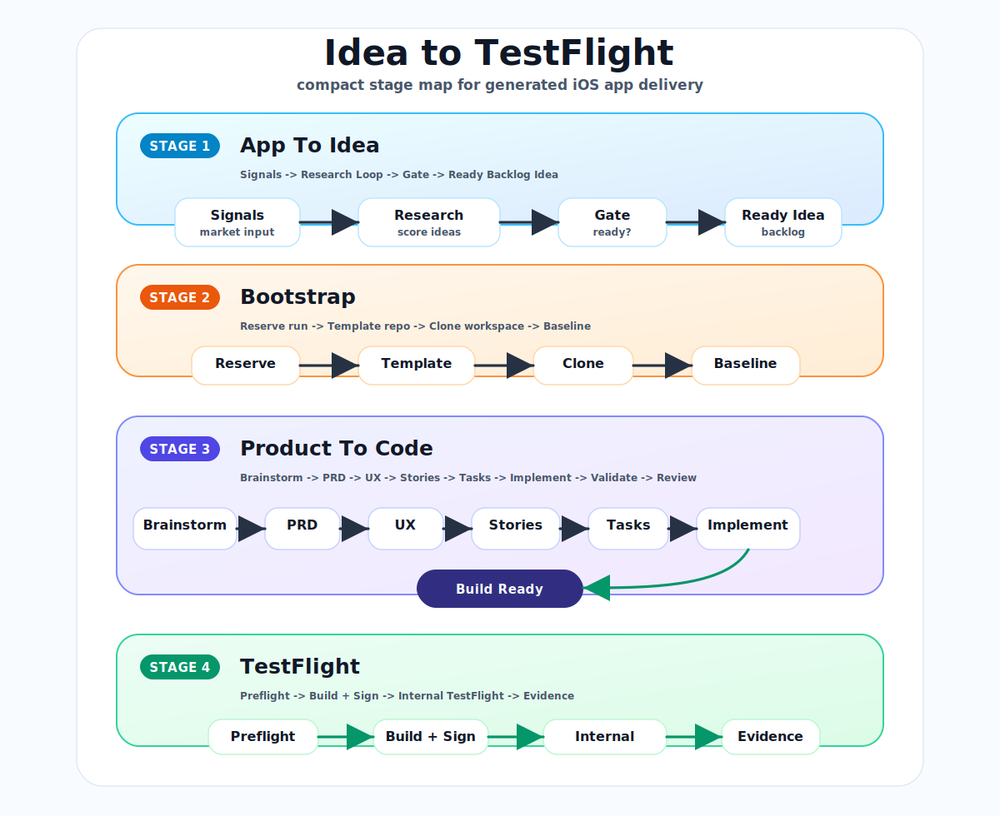

# Use Case: iOS App Factory

## Outcome

Turn one ready private backlog idea into a generated iOS app repo, run product-to-code, pass experience hardening, and upload an internal TestFlight build.

## When To Use

Use this when a candidate already exists in the private app factory backlog with status `ready`.

Do not use it for raw research. Run `app-opportunity-research` first when the backlog needs better ideas.

## Chain

```text
ready private backlog idea
  -> daily-ios-app-pipeline
  -> ios-app-factory-prepare
  -> product-to-code in generated repo
  -> experience-hardening
  -> ios-submit-testflight
  -> private state + generated repo commit/push
```

## Visuals

Primary top-down figure:


Compact stage figure:



PNG exports:

- `docs/assets/idea-to-testflight-flow.png`
- `docs/assets/idea-to-testflight-compact.png`

The deployable visual source lives in `docs/visuals/idea-to-testflight/`.

To regenerate exported SVG assets:

```bash
npm run export:idea-to-testflight
```

To regenerate exported SVG and PNG assets on macOS:

```bash
npm run export:idea-to-testflight:all
```

## Repo Surfaces

Workflows:

- `packs/vibermode/workflows/daily-ios-app-pipeline.md`
- `packs/vibermode/workflows/product-to-code.md`
- `packs/vibermode/workflows/product-to-spec.md`
- `packs/vibermode/workflows/spec-to-code.md`
- `packs/vibermode/workflows/experience-hardening.md`
- `packs/vibermode/workflows/ios-submit-testflight.md`

Scripts:

- `scripts/idea-backlog.mjs`
- `scripts/github-create-template-repo.mjs`
- `scripts/acquire-workspace.mjs`
- `scripts/ios-app-factory-prepare.mjs`
- `scripts/workspace-bundle-provision.mjs`
- `scripts/ios-submit-testflight.mjs`

Docs:

- `docs/operations/app-factory-automation-overview.md`
- `docs/operations/app-factory-state.md`
- `docs/operations/ios-repo-factory-token.md`
- `docs/operations/ios-testflight-submission-guidance.md`

## Automation

Codex automation:

```text
id: viber-ios-app-factory-manual-runner
name: Manual - Viber iOS App Factory
status: PAUSED
kind: heartbeat
```

This is a manual runner for Stage 2, Stage 3, and Stage 4 against one factory run manifest.

## State Boundaries

Reads:

- public ViberMode source
- private `ideas/backlog.json`
- iOS template repo
- optional private pattern catalog
- Apple/GitHub credentials from runtime only

Writes:

- private `factory/runs/[run-id].json`
- private `ideas/backlog.json`
- generated private iOS repo
- internal TestFlight upload state

Must not write:

- secrets into ViberMode
- private research outputs into public docs
- a second generated repo for the same blocked idea without review

## Success

- one idea is selected and reserved
- generated repo is created and cloned
- product-to-code reaches complete
- runtime validation, experience review, and final review pass
- generated repo commit is pushed
- TestFlight preflight passes
- internal TestFlight upload succeeds or is recorded as processing
- private run manifest records implementation and submission evidence

## Blockers

Stop before the next mutation boundary when:

- no eligible ready idea exists
- GitHub token cannot create or clone repos
- product-to-code validation fails
- experience review rejects the app after routed remediation
- TestFlight preflight reports missing Stage 3 evidence
- Apple credentials, signing, App Store Connect, or build upload fail

## Replacement Note

The old monolithic `ios-app-store-factory` workflow has been removed. This use case is the current replacement path, split across clearer stage owners.
